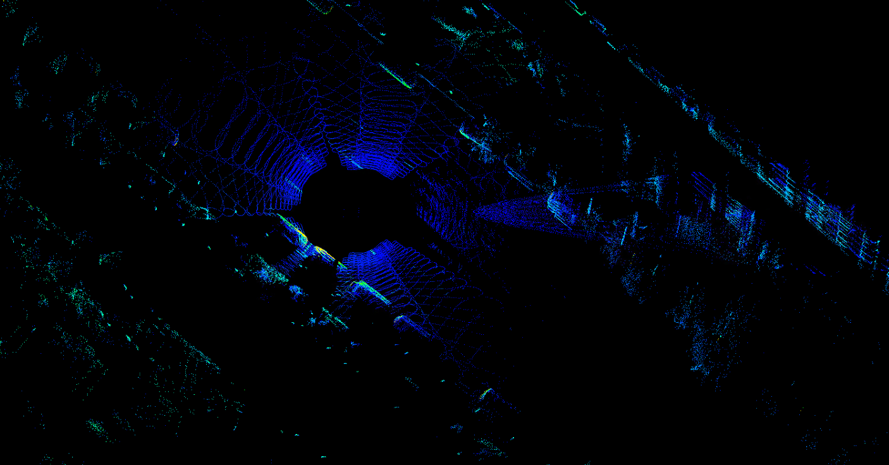
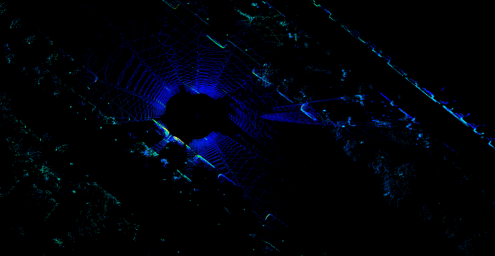

# livox_cloud_undistortion
This project is used for lidar point cloud undistortion. During the recording process, the lidar point cloud has naturally the distortion due to the affect of ego motion. Using the interpolation of ego motion, the distortion can be eliminated by transforming each point to the frame head or tail coordinate. Figures below show an example of undistortion. The left figure shows the row point cloud. The right figure shows the result of rotation distortion deskew.

<div align="center">


</div>

## Prepare the data
Data type: rosbag  
Topics: 
* /livox/lidar   type: livox_ros_driver::CustomMsg (transformed to sensor_msgs::PointCloud2 in the node livox_repub)
* /livox/imu     type: sensor_msgs::Imu

## Dependency
*  ROS
*  PCL
*  livox_ros_driver

## Build
In your work space
```
catkin_make
```

## Run
```
source devel/setup.bash
roslaunch livox_dedistortion_pkg run.launch
```

## Interface introduction
The member function UndistortPcl of the class ImuProcess defined in the header data_process.h, is used for the point cloud undistortion. The parameter Sophus::SE3d Tbe is the egomotion. If you can provide ego motion, just call this function. Otherwise, the function Process (also a member function of the class ImuProcess) is anothor choice, which uses the IMU data to deskew the rotation distortion.

## Other work
This project aims to eliminate ego motion distortion. For target motion distortion correction, we recommend reading this work for reference.
[Lidar with Velocity](https://github.com/ISEE-Technology/lidar-with-velocity)
